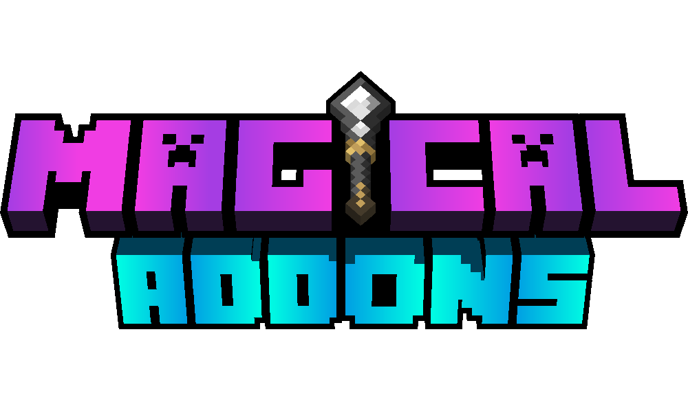

# Magical Addons

Magical Addons is an experimental data pack for Minecraft: Java Edition which allows you to craft magic equipment, fight new mobs and explore a reimagined Aether dimension. Designed to blend in with the base game progression and aesthetics.

Currently in development.

## ⚠️ Warning ⚠️
This is a standalone data pack that is not guaranteed to work with any complementary mods or shader packs.

## Setup
- Locate your .minecraft installation directory
- To add the data pack to an existing world : drop the "magical_addons_datapack" folder into the “datapacks” directory of your world
- To add the data pack to a new world : select the "More" tab in the new world settings, click "Data Packs", then drag the "magical_addons_datapack" into the Minecraft window
- Drop the "magical_addons_resourcepack" folder into the “resourcepacks” directory
- Select the "magical_addons_resourcepack" from your resource pack list

## Credits [A-Z]
- [GhostAdmiral](https://github.com/GhostAdmiral) (Project Lead, Programming, Game Design, Testing)
- Jatzylap (Project Lead, Programming, Game Design, Game Art, SFX, Testing)
- Kotew (Original concept, Programming, Game Design, Game Art)
- [NachoToast](https://github.com/NachoToast) (Programming)
- Odedbir (Programming)
- [Oisann](https://github.com/samsa12) (Narrative Design)
- [SammygoodTunes](https://github.com/SammygoodTunes) (Original Soundtrack, Testing)
